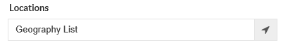
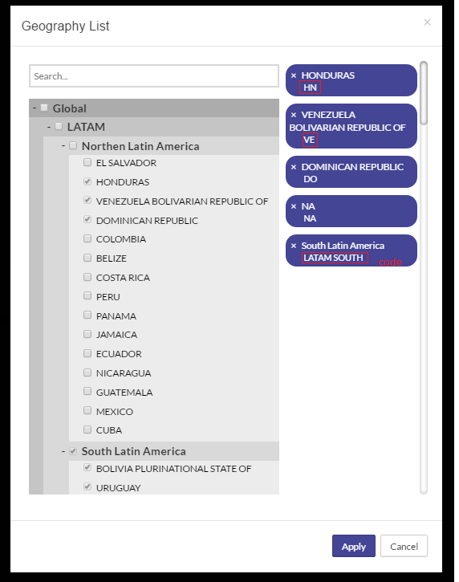
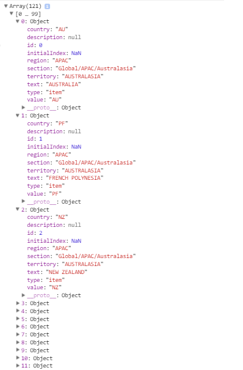
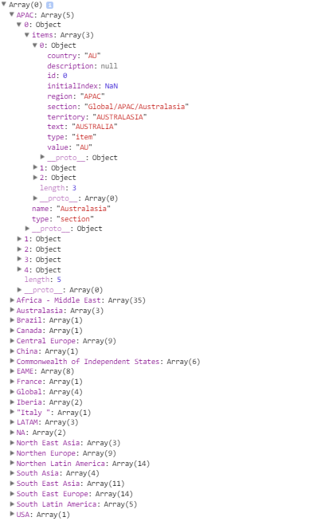
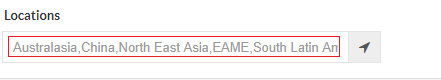
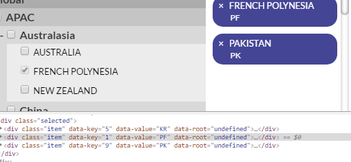
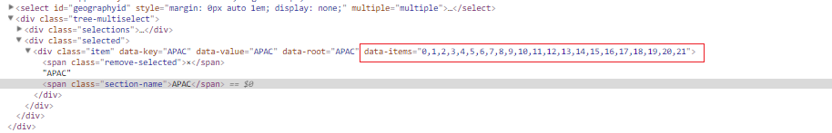

# Geography plugin guide  

## Objective 

  To implement a multilevel hierarchy tree to display regions, territories and countries which allow user to select, deselect, search and apply data saved into an input with selected data.

# Features

## Input

The input is responsible to view a textbox and by clicking the input icon a geography component will be shown in the modal.



## Ability to display name & code 

The result from geography component rendering will be list of nodes that shows as a tree hierarchy, a user can select nodes from left side and it will be shown in the right side with name and code.

 

## Ability to select multiple nodes till parent node 
A user can select multiple node then this nodes will be populated to the right side, case if all parent child’s selected child’s in the right side will be removed and will be replaced with the parent node.

 

## Global 
A user can select global and the global node will be selected on the right side then other nodes under global will be checked as they are checkboxes.

 

## Search 
Search option will be in the upper left side from the plugin which is not case sensitive, it can search with any case(Upper/Lower).


# Getting started with plugin properties and methods

 ## this.selectOptions  
 should have all roots(countries) child’s listed as the below, regions,country and territory fields are code binded from the object binded.

 
  
  
 ## this.keysToAdd 
 Have all keys needs to add, if this array initialized with [0,1,2,3] the plugin will be drawn by selecting nodes 0,1,2,3 in the right side which is the main factor to add the current selected values.

 ## this.keysToRemove 
 Have all keys needs to remove, if this array filled with [0,1,2,3] that's mean nodes with this keys will be removed from the right side and checkboxes will be unchecked.

## this.rootsToRemove 
Have all parents needs to remove, if this array filled with [APAC] that's mean that the plugin should remove this node from the right side and deselect all checkboxes in the left side for all items and Childs inside this parent.
 

## this.sectionsValues
This array have all the tree parents initialized with all items inside.



  ## this.geographyList={  territories:[],regions:[],countries:[], global:""} 
  The return object after onchange event fire from the plugin based on user selection

 

  ## this.selectedResult 
  The result in string which printed out the selected region, territory and country or global.

   

  ## this.sectionCreated 
  list all created sections(child roots selected), This dictionary will be filed with [key,value] which key will be the root name and value is "created or null" each time a new parent created in the right side.

## this.selectSections
Should have all parents of child’s selected 

## this.selectedRoots 

[key,value] dictionary which have parent, selected or unselected, that will define that this root is selected or unselected. used as a flag while removing or adding new parent. 

##  this.selectNodes

Have all Childs in div format listed in an array which used to append the html container with it if a user selects any checkbox.

##   this.selectedNodes 
Have all selected nodes in the right side selected in div format to be able to unselect it by removing it from the html container.

 #  Helper Methods

## Tree.prototype.removeItemsInRoot = function (sectionRoot,globalSelection) 
  This method is used to remove Childs inside a root given by root name and flag that is global which mean all Childs needs to remove and append a global node.

## Tree.prototype.checkNodesAreInRoot=function (nodeSelected)

Check array of items selected are in root to set this.selectedRoots[section]="selected"; then it will help to remove the items based on root selected. 

## Tree.prototype.checkItemsExist=function (array,items)
Check that is an array is sunset from another array to make sure that selected Childs if all of them are inside a root to success implement the remove method.

## Tree.prototype.checkGetParentRoots=function (roots,parents)
Set the global section roots with array selected or unselected based on actual selection and deselection. 

## Tree.prototype.getRootItems=function (rootName)
This should return parent/root items based on array of keys.

## Tree.prototype.refreshBasedOnPrevious = function (previousSelected)
This method only passed by previous selected items in keys format [0,1,2,3]to initialize the plugin case of cancel to get the previous selection after deselect and select.

## Tree.prototype.GetCodeByName = function (name) 
This Method get region or territory as a parent’s code based on name. 

## Tree.prototype.checkSelectedResults = function (optionsSelected) 
Should return  the result  after user selections and de select items in text and set geography list object with the correct values selected from the plugin below is the gegraphy list object should return.

```shell

  this.geographyList={
  territories:[],
  regions:[],
  countries:[],
  global:""
  }

```

## Onchange Event
At end of the render method the onchange event which is used outside the plugin to get and catch the result from the plugin as objects, accordingly the prams filled in inside tree multiselect should be return via call back out of this jquery method. 

## Plugin Css
* This plugin has it's own css applied from scss file in this path  assets\scss\bio\_geography-list.scss.

# Plugin cases and user Interaction scenarios

## Select child

* When a user click to checkbox a new key of the selected node will added to ketsToadd then render method will be called to display nodes based on keystoadd array then it will append this child into html container.



## Select parent 

* If a user click to parent check box it will add all Childs under this parent to keysToAdd and a new node will be defined with data-items added in the div node to know that this node is a parent hold data-items keys for deselection. 

 

 

## Deselect child 

* If a user clicked to X button to deselect a node the keystoremove array will filled with the key of node needs to deselect then render method called to handle this by removing these nodes from html container.

## Deselect parent 
* If a user clicked to X button to deselect a node and this node is root the rootstoremove will be filled with node name then render method called to handle this by removing this node from html container also it will unselect all items selected for the parent based on data-items attribute which have parent childs in keys format. 

## Select childs till parent

* If a user select child till reaching to the max number of the Childs inside the root or the parent, the keystoadd will filled with all Childs and every time check this.sectionsvalues that items of root is subset from the keystoadd then it will take sectionsvalues section name adding [key,value] in selecteroots by [rootname,"selected"] which mean this root selected then it will remove all Childs from right side and append the html container with a new node having parent name.


# Apply Plugin  Component in Aurelia 
 In shared/elements/geography-list there are two main components 

## geography-list-input
This component is the main which have the geography list component and it can be included by requiring it into any other component.


```shell
 <require from="../shared/elements/geography-list/geography-list-input"></require>
 <geography-list-input ></geography-list-input>
```

* It has an ability to display the geography-list component in a modal 

```shell
            <section class="col-xs-12 col-sm-6 col-md-6 col-lg-3">
            <label class="label">${ "AdvancedSearch.Locations_InputTitle" | t }</label>
                <div class="wrapper-ctrl">
                    <div class="row ">
                        <label class="col-xs-12 input">
                        <div class="input-group">
  <input id="txtgeography" class="form-control" type="text" placeholder="Geography List" readonly style="background-color: white">
    <span class="input-group-addon" data-toggle="modal" data-target="#myModal" style="cursor: pointer">
    <i class="fa fa-location-arrow"></i>
    </span>
</div>
                        </label>
                    </div>
                </div>
             </section>  
```

## geography-list

This is the component that have the dropdown content with the geography id which have the logic implemented to fire the jquery multiselect in Aurelia attached method to show the geography plugin as a transferred html tags.

```shell
 <div class="wrapper" style="overflow-x: hidden ;height: 600px;">

       <select  id="geographyid" style="margin: 0px auto 1em; display: block;" multiple="multiple" >

        <option   repeat.for="location of locations" value="${location.Code.Country}" 
        data-region="${location.Code.Region}"
        data-territory="${location.Code.Territory}"
        data-country="${location.Code.Country}"
        data-section="${location.Hierarchy}"   >
        ${location.CountryName}
        </option>
        </select>

   </div>
```

### getGeography()

This method responsible to request the api for getting locations hierarchy data to bind them within the locations dropdown. 

### fireUi(allSelected)
Remove the component div then redraw by fire the Jquery method on specific geography dropdown selected id passed by previous selected object values to initialize the component with ready selected nodes if a user navigate to the component and select nodes then click to cancel, the plugin should redrawn again by deselecting the current selected nodes.

The Jquery multiselect method have the following main prams that are used here :

* onChange: which has a delegate to a function which fire each time a user do select or deselect to checkbox.
* geography: this will have a list of keys [0,1,2,3,15,16] to draw the component with ready selected nodes in case a user applies a selection and needs to cancel then the previous selections should be populated again by fire the ui then pass this param to the geography.

* treeonChange: this function is the event result from selection and un selection value returned from the muliselectfunction it should return 
  * allSelectedItems : all nodes selected or all countries.
  * result: will return the text to be display in the input placeholder that tills a user which region, territory and country selected in a string format.
  * geographyListResult : it'll return the list after each change for (select or deselect) which have regions,territories,countires and if its global.

```shell

            $(this.element).find("div.tree-multiselect").remove();

                 var self=this;
                 $(this.element).find("select#geographyid").treeMultiselect({ searchable: true, searchParams: ['section', 'text'], 
                     onChange: treeOnChange ,enableSelectAll:false,allowBatchSelection:true,showSectionOnSelected:true,geography:allSelected});

                function treeOnChange(allSelectedItems, addedItems, removedItems,selectSections,result,geographyListResult) 
                {
                 
                   self.geographyResultTextSelected=result;
                   self.geographyObjectSelected=geographyListResult;
                   self.geographyAllSelectedCurrent=allSelectedItems;
                }
```

### renderGeography()
This method is build to render the geography and apply fire ui method after making sure that the locations data binded to the UI then the jquery will be fired once the locations rendered and binded to the html.

```shell 
rednerGeography()
{
         if (this.locations.length!=0) {
               this.fireUi(this.geographyAllSelectedPrev);
           }
         else {
                this.taskQueue.queueTask(
                    () => {
                    if(!this.locationsBinded)
                    {
                      this.getGeography();
                      this.locationsBinded=true;
                    }
                     this.rednerGeography();
                    }
                )
            }
}
```

### mapGeographyData()

Map geographylist selected result values to avoid reference issues for next selections. 

Set current selected regions, territories and countries with global to the previous value to set it while apply action.

```shell
mapGeographyData()
{
        var self=this;
        self.geographyObject.countries= self.geographyObjectSelected.countries;
       self.geographyObject.regions= self.geographyObjectSelected.regions;
        self.geographyObject.territories= self.geographyObjectSelected.territories;
          self.geographyObject.global= self.geographyObjectSelected.global;

}
```

### cancel()
The cancel method should rest all current selections from the user and take previous objects then fire the ui again to reset new user selections.

```shell
cancel()
{ 
       var self=this;
       self.geographyAllSelectedCurrent=null;
       self.geographyObjectSelected=null;

       document.getElementById("txtgeography").placeholder=self.geographyResultTextSelectedPrev;
       self.geographyResultTextSelected=self.geographyResultTextSelectedPrev;
       this.fireUi(self.geographyAllSelectedPrev);

}
```

### apply()

This will update the two-way binding objects with the result from user selections in the plugin, initially it will call map geography data then replace all updated objects that have been filled in onchange event and keep them in previous objects in case of cancel to refresh the plugin with them after another selection.

```shell
    apply()
    {
    var self=this;
    self.mapGeographyData();
    document.getElementById("txtgeography").placeholder = self.geographyResultTextSelected
    self.geographyResultTextSelectedPrev=self.geographyResultTextSelected;
    self.geographyAllSelectedPrev=self.geographyAllSelectedCurrent;
    self.fireUi(self.geographyAllSelectedPrev);

}
```


